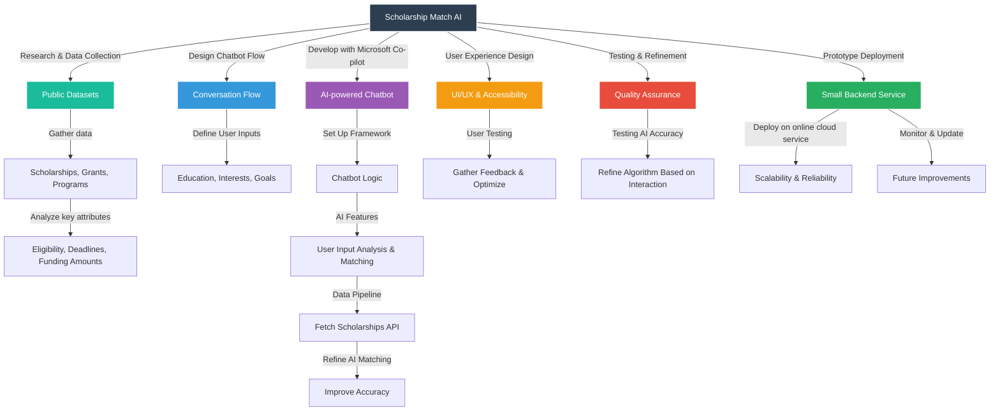

# 🖥️ ECIU AI Hackathon Development Road Map 🖥️

Student project by Will Mitchell, Phoebe, Aapo Piirainen and Ibtehaz. This project was done for the AI Hackathon hosted by ECIU from *Tampere University*. All ideas and logs for the project will be found on this *ReadMe* with the inclusion of dates, and no edits to past ideas/structure/development, this is a prototype app.

# 🚀Timeline🚀

**2/3/2025** -- Team met for the first time, introductions and strengths were discussed!

**4/3/2025** --   Ibtehaz outlined first steps for preparing for the hackathon and general idea development, team met over Microsoft teams and discussed ideas

 ```code
I'm gonna create a GitHub repository and a base template for the code. 
@Will will write the readme and give 3/4 APIs to fetch scholarship/grant/other information. 
Each of us will write 1 cronjob whose basic functionality would be to fetch data from that said API and save it in our database.

We will touch base on Chat in March 06/07 to see where we are at and if we need any help. 
@~Phoebe can start with the presentation slide.
@~Aapo Piirainen will send the email to headai api.

yeah thats all.  So please share your GitHub and suggest a name for this project.
```

-- Agreed upon idea was Will's idea of Scholarship/Research/Funding aggregation, funneled into an ChatBot that has awareness of student data as well as the ECIU platform to match students with opportunities they are interested in and find funding in there field **Found Below**

[](https://docs.google.com/document/d/1-c7cVAG4mecptwa2-TT3cUULhtHwOCTfleN3dqVJXQc/edit?usp=sharing)

**6/4/2025** -- Will Created ReadMe with a simple graph structure of our layout as a WIP

## 🏢Structure🏢



## To-Do

**6/3/2025** -- Find Scholarship Aggregate API's (Will)

**6/3/2025** -- Start on Presentation Slides and Structure (Phoebe)

**6/3/2025** -- Send Email to HeadAI (Aapo)

## How to Use

This Django project is configured to use Google Firestore as its database backend. It is suitable for both local development using Gunicorn and production deployment on Google Cloud Platform (GCP).

* Firestore Configuration:

  * Ensure you have a Firebase project and Firestore set up.

  * Place your Firebase project's service account JSON file in the `elia` folder within your Django project directory.

  * fix the filename in `firebase_config.py` file in `elia` folder.

* Environment Setup:

```bash
python -m venv venv
source venv/bin/activate
```

* Install required Python packages:

```bash
pip install -r requirements.txt
```

* Running Locally:

```bash
gunicorn -b :8000 elia.wsgi:application
```

Project is also configured to be uploaded in your Google Cloud.
